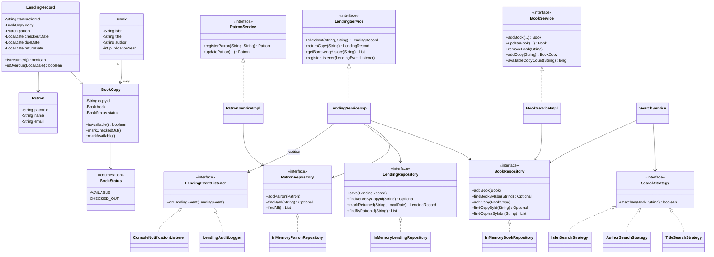

# Library Management System

A Java implementation of a library management system: books, patrons, and
the checkout/return lending workflow, backed by an in-memory data store (no
database, no web layer - just the domain model and services, per the
assignment scope).

## What's here

- **Book management** - add, update, remove books; a title can have
  multiple physical copies, and availability is tracked per copy.
- **Patron management** - register and update patrons, view their
  borrowing history.
- **Lending** - checkout and return, with validation (no double-checkout,
  no returning something that isn't checked out).
- **Search** - by title, author, or ISBN.
- **Inventory** - available vs. checked-out copy counts per title.

Multi-branch support, reservations, and recommendations were on the list of
optional extensions but are not implemented here - the interfaces are
structured so they could be added without reworking what's already there
(see *Design notes* below), but I chose to keep the core scope solid rather
than spread thin across all three.

## Getting started

Requires Java 25+ and Maven 3.8+.

```
mvn clean package      # build + run tests
java -jar target/library-management-system.jar   # run the app
mvn test                # tests only
```

Running it starts a text menu (`com.library.app.LibraryConsoleApp`) - add,
update, or remove books and patrons, search, check out, return, and view
borrowing history. It loads a couple of sample books and a patron on
startup so there's something to search/checkout right away; option `0`
exits.

## Design notes

**`Book` vs `BookCopy`.** A `Book` is catalog metadata - title, author,
ISBN, year. It's not itself lendable. A `BookCopy` is a physical instance
of that title with its own ID and status (`AVAILABLE` / `CHECKED_OUT`).
Splitting these two apart is what makes "track available and borrowed
books" actually correct once a library owns more than one copy of a title
- modeling status directly on `Book` breaks the moment there's a second
copy.

**Design patterns.** Two, plus a bonus:
- *Strategy* - `SearchStrategy` has one implementation per searchable field
  (`TitleSearchStrategy`, `AuthorSearchStrategy`, `IsbnSearchStrategy`), and
  `SearchService` picks the right one for a given `SearchField`. Adding a
  new searchable field later means adding a class, not touching existing
  search logic.
- *Observer* - `LendingService` is the subject; `LendingEventListener`
  implementations (`LendingAuditLogger`, `ConsoleNotificationListener`)
  subscribe to checkout/return events without `LendingService` knowing or
  caring what they do with them.
- *Repository* - `BookRepository`, `PatronRepository`, `LendingRepository`
  are interfaces; services depend on those, not the `HashMap`-backed
  implementations, so storage could be swapped out later without touching
  service logic.

**OOP and SOLID, where they actually show up:**
Encapsulation - fields are private, and mutations like `Book.updateDetails`
or `BookCopy.markCheckedOut` go through methods that can enforce
invariants, not raw setters. Inheritance - every domain exception extends
`LibraryException`, so callers can catch one type and handle any of them.
Polymorphism/abstraction - the three repository interfaces and three
service interfaces mean calling code never depends on a concrete
in-memory class, which is also what gives Single Responsibility (one
package per entity), Open/Closed (new strategies/listeners without editing
existing ones), and Dependency Inversion (constructor injection
everywhere, no `Singleton`, no static state).

**A couple of deliberate calls worth noting:**
- Repositories use `ConcurrentHashMap` rather than `HashMap` so the code
  doesn't fall over if it's ever touched from more than one thread. That's
  not a claim that it's fully thread-safe end-to-end though - `checkout`
  checks availability and then marks a copy checked out in two separate
  steps, which isn't atomic. Real locking would fix that; felt out of
  scope here.
- Logging uses `java.util.logging` instead of a third-party framework -
  covers the requirement without adding a dependency for something this
  small.

## Class diagram



## Project structure

```
src/main/java/com/library/
├── book/            Book, BookCopy, repository + service
├── patron/          Patron, repository + service
├── lending/         LendingRecord, repository + service (checkout/return)
├── search/          SearchStrategy implementations + SearchService
├── notification/    LendingEventListener implementations (Observer)
├── common/          Domain exceptions
└── app/             Main (wiring) + LibraryConsoleApp (menu)
src/test/java/com/library/   mirrors the above
```

## Assumptions

- ISBN is unique per title and is the catalog key.
- Loan period is fixed at 14 days from checkout.
- IDs (copy, patron, transaction) are server-generated UUIDs.
- Single library, single process - no persistence between runs.
