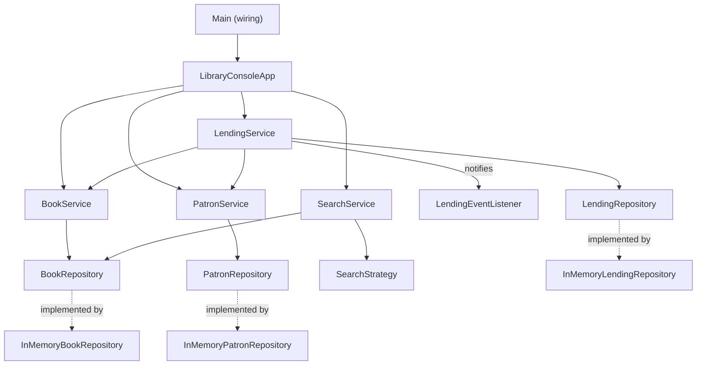
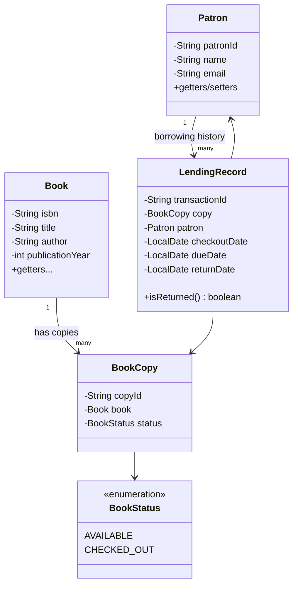

# Architecture — Library Management System

This is the ground-truth design document for the project. Any session (human
or AI) making a non-trivial change should read this first and flag a
conflict rather than silently deviating from it. See `/RULES.md` for the
operating rules that enforce this.

## 1. System Overview

This is a **single-process, in-memory Java library** (not a web service). It
is an LLD (Low-Level Design) exercise: the deliverable is the object model,
the SOLID/OOP reasoning, and the design patterns — not a deployed system.
There is no database, no HTTP layer, and no external API, per the brief
("Don't worry about persistence, databases, or external APIs at this
stage"). `Main` wires everything up and hands off to `LibraryConsoleApp`, a
text menu that drives the same public service API a real caller (a CLI, a
future REST controller, a test) would use.

Everything below the service layer is swappable behind interfaces
(`BookRepository`, `PatronRepository`, `LendingRepository`). That is a
deliberate seam, not speculative generality: it is the natural extension
point if this ever grew a persistence layer, and it is also what makes the
services unit-testable without any in-memory-map wiring leaking into test
code.

## 2. Tech Stack

| Choice | Justification | Rejected alternative |
|---|---|---|
| Java 25 (LTS) | Latest LTS release (Sept 2025); records, sealed-friendly enums, modern collection factories (`List.of`) reduce boilerplate. Targeting the current LTS rather than letting the project quietly drift behind avoids an awkward "why is this on an old runtime" question later. | Java 21 (previous LTS) — still fully supported, but no reason to target the older LTS on a fresh exercise once 25 is out and stable. |
| Maven | Most universally recognized build tool for a reviewer skimming a take-home; `mvn test` / `mvn package` "just works" with zero prior context. | Gradle — equally capable, but Maven's verbosity is a non-issue at this project's size and its ubiquity matters more here. |
| JUnit 5 | Standard modern Java testing framework; parameterized tests suit the "search by title/author/ISBN" and "checkout edge cases" scenarios well. | TestNG — no advantage here, less common. |
| `java.util.logging` (JUL) | The brief requires "a logging framework." JUL ships in the JDK — zero extra dependencies, zero version-pinning risk, nothing that can fail to resolve on a reviewer's machine. It satisfies the requirement without adding ceremony a console-only exercise doesn't need. | SLF4J + Logback — the more "production" choice, but two extra dependencies and a config file bought nothing here beyond aesthetics. Revisit if this project ever grows a real deployment target. |
| Plain Java, no framework | There is no persistence/API/web surface, so there is nothing for Spring (or any DI framework) to wire. Constructor injection by hand is enough to demonstrate DIP and keeps every class's dependencies visible at the call site. | Spring Boot — would add configuration and annotations that obscure the OOP/SOLID reasoning the exercise is actually graded on. |

## 3. Data Model

Two things are worth calling out because they're the crux of the "LLD
correctness" of this design, not just naming:

- **`Book` vs. `BookCopy`.** A `Book` is catalog metadata (title, author,
  ISBN, publication year) — one row per *title*. A `BookCopy` is a physical,
  lendable instance of that title (its own copy ID and status). A library
  owns multiple physical copies of the same ISBN; checkout/return and
  availability are properties of a *copy*, not the abstract title. Modeling
  these as one class is the most common mistake in this exercise and it
  breaks "track available and borrowed books" the moment a library owns more
  than one copy of a title.
- **`LendingRecord` is the transaction, not a field on `Book`.** Checkout
  history belongs to a first-class record (copy, patron, checkout date, due
  date, return date) so both "patron's borrowing history" and "is this copy
  currently out" can be derived from the same source of truth instead of
  duplicated state.

Full class-level diagram (including services, repositories, and patterns)
lives in `README.md` per the submission requirement; this section is the
domain model only.

## 4. "API" Design Approach

There is no network API. The public surface is the **service interfaces**
(`BookService`, `PatronService`, `LendingService`, `SearchService`) — plain
Java methods with typed parameters and checked/unchecked domain exceptions
instead of HTTP status codes. This is intentional: if the project ever grew
a REST layer, each service method maps ~1:1 to an endpoint, and the
interface boundary means controllers would be a thin adapter, not a
rewrite. No versioning scheme is needed for an in-process API; if this
becomes relevant later it becomes relevant at the (not-yet-built) HTTP
layer, not here.

## 5. Service Boundaries

**Single Maven module, package-by-feature internally** (`book`, `patron`,
`lending`, `search`, `notification`, `common`). This is not a "modular
monolith" in the distributed-systems sense — there's only one process — but
the internal package boundaries are drawn the same way a modular monolith
would draw them, so that splitting a package into a separate module later
(if this ever became a real multi-branch system) is a mechanical move, not a
redesign.

Microservices were never a candidate: there is no independent scaling need,
no independent deployment need, and no team boundary to justify the
operational cost. Defaulting to microservices for an in-memory take-home
would be exactly the kind of trend-chasing this doc is meant to prevent.

## 6. Scalability Plan

Explicitly out of scope per the brief, and honestly out of scope for an
in-memory program with no concurrent multi-user access requirement. Two
things are still worth stating for the record:

- **Concurrency**: repositories use `ConcurrentHashMap` instead of
  `HashMap`. This costs nothing, and means the code doesn't silently break
  if a test or demo ever exercises it from more than one thread. It is *not*
  a claim that this system is production-safe for concurrent access —
  compound operations like "check availability, then mark checked out" are
  not atomic across the two calls, and making them so would need explicit
  locking or a different concurrency model. That's a deliberate line: enough
  to not be sloppy, not enough to be over-engineered for a scope that
  explicitly excludes real load.
- **If this became a real backend**: the repository interfaces are the
  seam. Swapping `InMemoryBookRepository` for a JDBC- or JPA-backed
  implementation touches one class per repository and nothing in the
  service layer, because services depend on the interface, not the
  implementation (DIP).

## 7. Security Architecture

Not applicable — no authentication surface, no persisted PII beyond a
patron's name/email held in memory for the life of the process, no secrets.
If this became a real multi-user system, the natural seam is a librarian-vs-
patron role check at the service layer (an `AuthorizationPolicy` consulted
before mutating operations), added when there's an actual caller identity to
check.

## 8. Third-Party Integrations

None. `java.util.logging` is JDK-provided, not a third-party dependency.
JUnit 5 is a test-scope dependency only and never ships in the runtime jar.

## 9. Deployment / Infra Plan

"Deployment" for this project is `mvn clean package` producing a runnable
jar, and "running it" is `java -jar target/library-management-system.jar`
starting the console menu. No environments (dev/staging/prod) — there is one
environment: whoever runs the jar. A minimal GitHub Actions workflow
(`.github/workflows/ci.yml`) runs `mvn test` on every push and PR — this is
included not because the project needs CI at scale, but because it costs
one YAML file and is the kind of engineering hygiene a reviewer notices in a
public-repo PR submission.

## 10. Non-Functional Requirements

- **Correctness** over performance: every core operation (add/remove/update
  book, checkout, return, search) has a unit test covering the happy path
  and at least one edge case (double checkout, checkout of a non-existent
  copy, returning an already-returned copy, etc.).
- **Lookup cost**: ISBN → `Book`/`BookCopy` lookups are O(1) via map
  indexing. Title/author search is O(n) linear scan with case-insensitive
  substring matching — acceptable at any catalog size this exercise will
  plausibly be tested with; a real system would add a secondary index (e.g.
  a text search engine) only once a measured need existed.
- **Availability / uptime targets**: not applicable — this is not a running
  service.

## 11. Explicitly Rejected Approaches

So future sessions don't re-litigate these:

- **Merging `Book` and `BookCopy` into one class.** Rejected — breaks
  multi-copy availability tracking, which "keep track of available and
  borrowed books" requires the moment a title has >1 copy.
- **Singleton for the library/catalog.** Rejected in favor of
  constructor-injected repositories and services. A Singleton would make the
  design untestable (hidden global state) and violates the DIP reasoning the
  exercise is graded on.
- **Spring Boot / any DI framework.** Rejected — nothing to wire; framework
  ceremony would obscure the OOP reasoning that's actually being evaluated.
- **SLF4J + Logback.** Rejected in favor of `java.util.logging` — see
  Section 2. Revisit only if this grows into a real deployed service.
- **REST/GraphQL API layer.** Rejected — no network surface required or
  requested by the brief.
- **Multi-branch support, reservation system, recommendation system.**
  Explicitly deferred out of v1 (confirmed with project owner). The
  repository/service interface seams are drawn so these could be added
  later without a redesign (e.g. a `NotificationService` observer hook
  already exists for lending events and would extend naturally to
  "reserved book became available").
- **Speculative `LibraryItem` inheritance hierarchy** (for future DVDs,
  magazines, etc.). Rejected as premature abstraction — the brief asks for
  `Book` only; adding an unused hierarchy "for extensibility" would be
  guessing at requirements that don't exist yet.

## 12. Design Patterns Applied

Two are load-bearing for the brief's "at least two design patterns"
requirement:

1. **Strategy** — `SearchStrategy` interface with `TitleSearchStrategy`,
   `AuthorSearchStrategy`, `IsbnSearchStrategy` implementations, selected by
   `SearchService`. Maps directly onto "search by title, author, or ISBN"
   without an `if/else`/`switch` chain, and adding a new search dimension
   later (e.g. by publication year) means adding a class, not editing
   existing ones (Open/Closed Principle).
2. **Observer** — `LendingService` is the subject; `LendingEventListener`
   implementations (e.g. an audit logger) subscribe to checkout/return
   events. This decouples "a checkout happened" from "what should react to
   it," and is the exact seam a future reservation-notification feature
   would hook into without touching `LendingService` itself.

A third pattern is used but doesn't count toward the "two" since it's
architectural rather than GoF-behavioral: **Repository** (`BookRepository`,
`PatronRepository`, `LendingRepository`) to satisfy the Dependency Inversion
Principle — services depend on abstractions, not on `HashMap` details.
